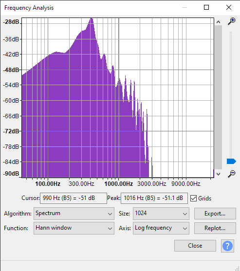
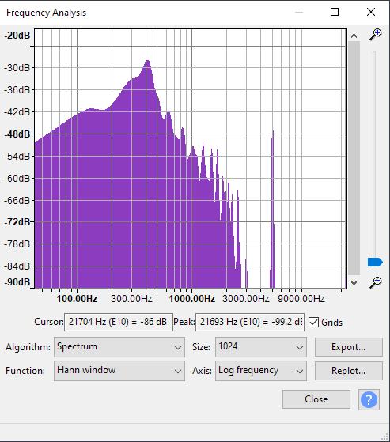
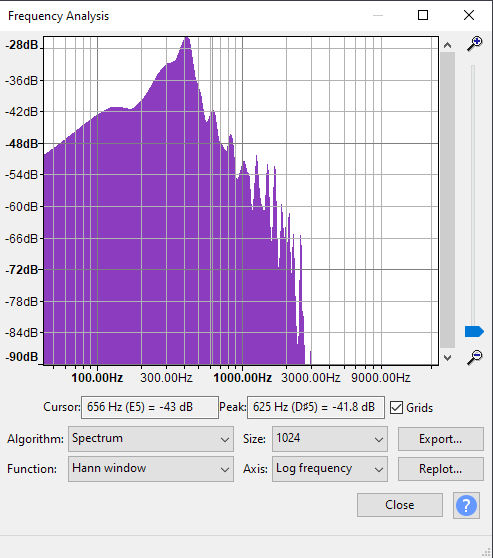
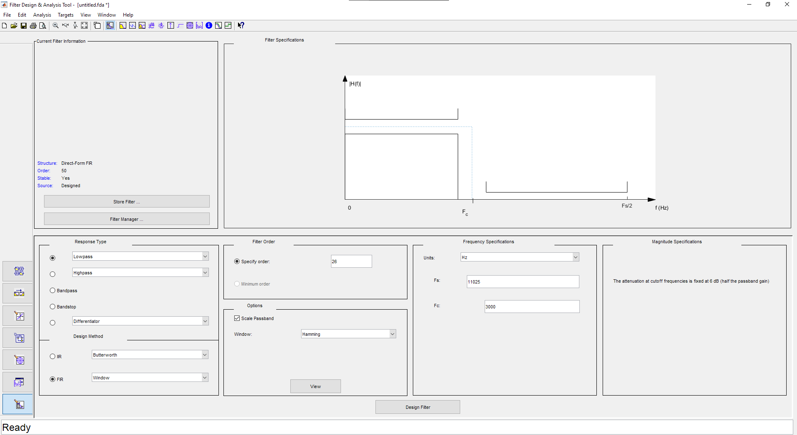
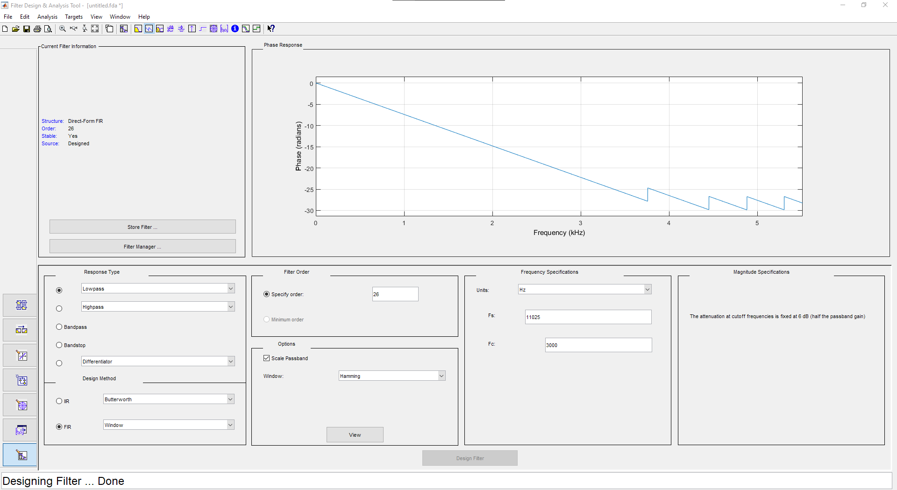
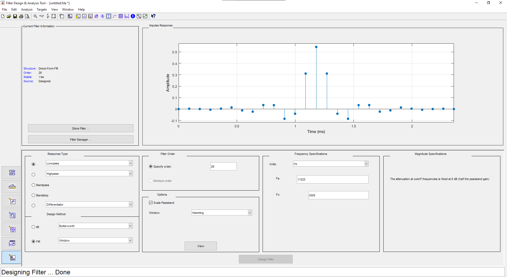
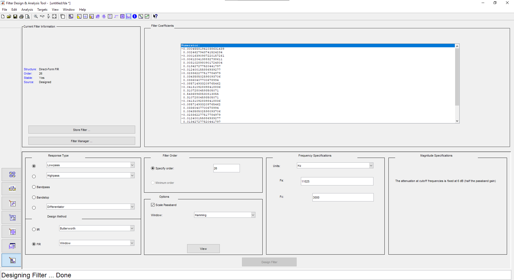

# FIR filter Python implementation

This is a demo for designing an FIR (Finite Impulse Response) filter using MATLAB Filter Designer and implementing the filter using Python.

## To run it
\*Python 3.x is required
<br>
1- Install required modules:
<br>
```
pip install -r requirements.txt
```

2- To run the Python script:
<br>
```
python fir_filter.py
```

## The Problem
It is required to filter an audio signal that has a noise tone of 5kHz to remove the noise.
<br>
This audio signal is read from a ".wav" file of a sampling frequency of **11025Hz** and have 32-bit float samples.
<br>

<br>*The spectrum of the original audio signal*
<br>

<br>*The spectrum of the noisy audio signal*
<br>

<br>*The spectrum of the filtered audio signal*

## Filter design

This design can be achieved by using MATLAB Filter Designer.
<br>


<!--  -->
<br>*MATLAB Filter Designer*
<br>

<br>*Filter magnitude response*
<br>

<br>*Filter phase response*
<br>

<br>*Filter impulse response*
<br>

<br>*Filter coefficients*
<br>
<br>
Filter save file: [Filter_Designer.fda](Filter_Designer.fda)


## Implementation

Python will be used to implement the filter. To read the samples from the audio file, scipy.io module is used to read the samples and write the filtered samples into the output ".wav" file.
Then the read samples are added to the buffer (which acts as input delay).


## Conclusion

The filter is successfully implemented using python but with performance issues.
Futher optimisation can be achieved by reducing the filter order or by using multi-threading to decrease the computation time or by implementing a more efficient buffering method.