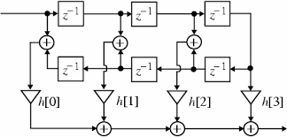

# FIR filter Python implementation

This is a demo for designing an FIR (Finite Impulse Response) filter using MATLAB Filter Designer and implementing the filter using Python.

## To run it
\*Python 3.x is required
<br>
1- Install required modules:
<br>
```
pip install -r requirements.txt
```

2- To run the Python script:
<br>
```
python fir_filter.py
```

## The Problem
It is required to filter an audio signal that has a noise tone of 5kHz to remove the noise.
<br>
This audio signal is read from a ".wav" file of a sampling frequency of **11025Hz** and have 32-bit float samples.
<br>

<br>*The spectrum of the original audio signal*
<br>

<br>*The spectrum of the noisy audio signal*
<br>

<br>*The spectrum of the filtered audio signal*

## Filter design

This design can be achieved by using MATLAB Filter Designer.
<br>

<br>*Filter magnitude response*
<br>


## Implementation
The implementation is based on the realization of the linear phase filter.
<br>

<br>*Linear phase realization model*
<br>

To achieve the delayed samples the implementation utilizes a buffer of the same length as the filter coefficients.
```python
buffer = [0.00]*len(coeffs)
```
Then the code iterates over the samples and circulates the buffer by removing the first element in the array and adding a new sample to the array.
```python
for sample in data:
    buffer.pop(0)
    buffer.append(sample)
```
As the coefficients are symmetric, only the first half of the coefficients array is used.
```python
coeffs_linearphase = coeffs[0:int((len(coeffs)+1)/2)]
```
Then a for loop iterates over the coefficients to apply the filter by multiplying the coefficients with the respective delayed sample and the output sample is the summation of the multiplication.
```python
for i in range(len(coeffs_linearphase)):
    coef = coeffs_linearphase[i]
    if i == (len(coeffs_linearphase)-1) :
        out_sample += coef*buffer[(len(coeffs_linearphase)-1)]
    else:
        out_sample += (buffer[i]+buffer[(len(coeffs)-1)-i])*coef

output.append(np.float32(out_sample))
```


scipy.io module is used to read the samples and write the filtered samples into the output ".wav" file.


## Conclusion

The filter is successfully implemented using python but with performance issues.
Futher optimisation can be achieved by reducing the filter order or by using multi-threading to decrease the computation time or by implementing a more efficient buffering method.